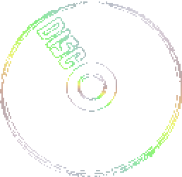

<div align="center">



# TacticToe

A two-player tic-tac-toe game for the terminal, written in C++. My first c++ project

</div>

## How to play

Players take turns (X goes first) and type a number from 1 to 9 to place a piece:

```
 1 | 2 | 3
---+---+---
 4 | 5 | 6
---+---+---
 7 | 8 | 9
```

Get three in a row, column, or diagonal to win. If the board fills up, it's a draw.

## Run it

```bash
g++ main.cpp -o tactictoe
./tactictoe
```
